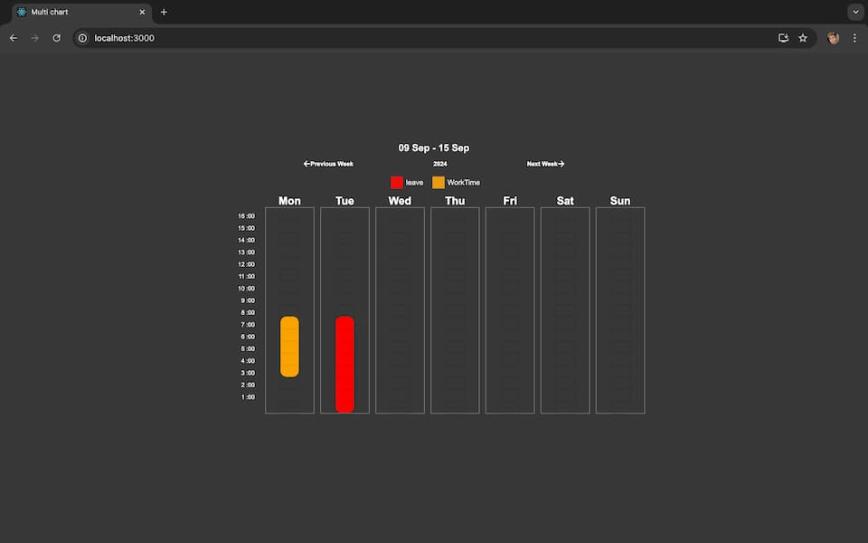

React Week Chart
#The module is still in test process
react-week-chart is a React component for visualizing data as range in weekly view. It's designed to be flexible and easy to integrate into your React applications.

🚀 Features

Dynamic Range Selection: Allows users to select and view multiple date ranges.
Customizable: Easily customize the appearance of the calendar and date ranges.
Flexible Date Handling: Supports various date formats and locales.
⚠️ Under Testing

This library is currently under testing and development. While we are working hard to make it stable and reliable, please be aware that some features may be experimental or subject to change. We appreciate your feedback and contributions to help improve this library.

📦 Installation

To install react-multi-range-viewer, use npm or yarn:

bash
Copy code
npm install react-multi-date-range-viewer
or

bash
Copy code
yarn add react-week-chart



Example of use

```jsx
import moment from "moment";
import WeekDetails from "./ReactWeekChart";

const data = [
  {
    beginNumber: 0,
    endNumber: 7,
    key: "1",
    type: "leave",
    color: "red",
    textColor: "white",
    cellTextColor: "blue",
    day: moment().add(1, "day").toString(),
  },
  {
    beginNumber: 3,
    endNumber: 7,

    key: "2",
    type: "WorkTime",
    color: "orange",
    textColor: "white",
    day: moment().toString(),
  },
];
const App = () => {
  return (
    <div
      style={{
        height: "500px",
        width: "700px",
        margin: "auto",
        marginTop: "10%",
      }}>
      <WeekDetails
        extension=":00"
        GuidComponent={<GuidComponent />}
        data={data}
      />
    </div>
  );
};

export default App;
const GuidComponent = () => {
  return (
    <div
      className="guid-colors-parent"
      style={{ color: "white" }}>
      {data.map((r: any) => (
        <span>
          <span
            className="guid-colors-shape"
            style={{ backgroundColor: r.color }}></span>
          <span>{r.type}</span>
        </span>
      ))}
    </div>
  );
};
```
